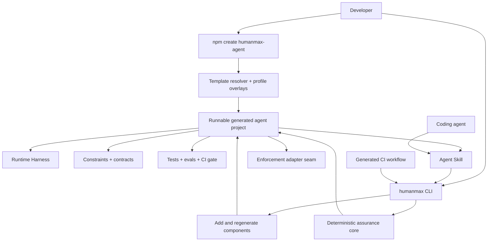
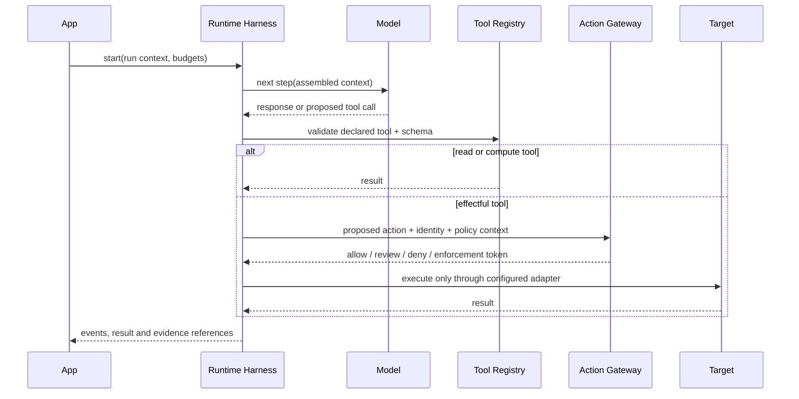

# HumanMax Agent Harness

**Open-source product design**

**Version:** 0.3 draft

**Date:** 29 August 2026

**Owner:** [HumanMax.AI](http://HumanMax.AI)

**Target repository:** `humanmax-harness` under the company GitHub organisation

## Executive summary

HumanMax Agent Harness is an open-source, local-first project generator and runtime scaffold for building assurance-ready AI agents. Its primary experience is comparable to `create-next-app`: one command creates a runnable agent project whose action boundary, engineering constraints, jurisdiction-aware profiles, tests, CI gate and reproducible assurance evidence are present from the first commit.

The product is **scaffold-first, CLI-maintained, Skill-assisted and CI-enforced**:

- *`create-humanmax-agent`** generates a complete project from a versioned template and profile overlays;

- the generated **Runtime Harness** owns deterministic development mechanics that should not be delegated to model behaviour: run state, budgets, tool registration, schema validation, checkpoints, cancellation and a single action-gateway seam;

- canonical **constraints and contracts** declare ownership, autonomy, data handling, tools, approvals and prohibited actions;

- the **HumanMax CLI** adds components, regenerates derived files, tests invariants, checks governance controls and produces evidence throughout development;

- the **Agent Skill** teaches coding agents to build inside the generated architecture without bypassing its execution seams;

- the generated **CI workflow** runs build, tests, evaluation and Harness checks on every pull request.

The generated project must run locally without a HumanMax account. Assurance checks must work without a model, cloud account or network connection after dependencies and selected Control Packs are installed. Local adapters and bypass tests establish the engineering seam but do not create production authority. Consequential production actions connect through an explicit enforcement adapter to the HumanMax Trust Engine, a customer-owned policy service or another deterministic enforcement system.

## 1. Product decision

### 1.1 One generator, one project contract, multiple interfaces

The generated project is the product. The generator creates it; the CLI, Skill and CI keep it conformant as it evolves.



The generator and CLI share the same versioned project contract. The Agent Skill never invents an alternative file layout or reimplements a rule in natural language; it invokes the pinned CLI and treats its generated artefacts and JSON results as authoritative.

### 1.2 Product name

Use **HumanMax Agent Harness** as the global product name. Singapore localisation is delivered through `sg-core` and sector packs rather than embedded in the product name.

Recommended identifiers:

| Surface | Identifier |

|---|---|

| GitHub repository | `humanmax-harness` |

| bootstrap package | `create-humanmax-agent` |

| project dependency | `@humanmax/harness` |

| executable | `humanmax` |

| canonical skill | `humanmax-agent-harness` |

| project directory | `.humanmax/` |

| rule prefix | `HMX-` |

Final names depend on namespace availability and trademark review.

### 1.3 Product promise

> Create a local-first, assurance-ready agent project with explicit action boundaries, jurisdiction-aware controls and evidence-producing CI.

### 1.4 Trust boundary

The following order is normative:

1. project schemas, tool/action contracts and signed/locked Control Packs;

2. generated Runtime Harness and its single action-gateway seam;

3. explicitly configured enforcement/evaluation adapter contracts and their recorded results;

4. deterministic Harness Core;

5. CLI-generated artefacts, JSON results and evidence manifest;

6. CI presentation and annotations;

7. Agent Skill interpretation and proposed changes;

8. generated prose such as `AGENTS.md`.

A lower layer cannot override or suppress a higher layer. A coding agent cannot bypass the action gateway, convert `FAIL`, `UNKNOWN` or `NEEDS_HUMAN_REVIEW` into `PASS`, or treat instructions in prose as execution authority. This Layer 01 precedence governs project and evidence integrity; actual production authorisation remains the responsibility of the deployed enforcement boundary.

## 2. Users and jobs to be done

| User | Job | Primary interface |

|---|---|---|

| Agent developer | Create a runnable agent with safe defaults and add capabilities without reconstructing the architecture | Generator + CLI + Agent Skill |

| Platform engineer | Standardise runtime, agent and tool contracts across repositories | Templates + profiles + schemas |

| Security engineer | Identify undeclared effectful paths and unsafe boundaries | CLI JSON/SARIF |

| Risk/governance owner | Review mappings, exceptions, owners and evidence | Evidence bundle |

| Open-source maintainer | Add rules, inspectors, fixtures and community packs | Core APIs + tests |

| CI/release owner | Prevent new blocking findings from entering protected branches | GitHub Action/CLI |

The primary adoption target is a new agent project or a new bounded agent service inside an organisation. Existing-repository adoption is a secondary, explicit retrofit workflow because it cannot promise the same structural consistency as a clean generated project.

## 3. Scope and non-goals

### 3.1 In scope

- create a runnable TypeScript agent project from a versioned template;

- generate a deterministic Runtime Harness with state, budgets, tool registry, checkpoints, cancellation and execution seams;

- generate agent, tool, action, data, approval and ownership declarations;

- generate `AGENTS.md`, an Agent Skill, tests, evals, documentation and CI gates;

- add agents, tools and evals through repeatable generators;

- upgrade generated projects through a previewable, version-aware migration contract;

- adopt an existing repository through previewed, non-destructive retrofit;

- discover declared and observable agents, tools, MCP servers and effectful actions;

- validate manifests and cross-file references;

- run deterministic structure, authority, data, security, lifecycle and evidence checks;

- apply locked community Control Packs;

- distinguish confirmed findings from unknown or incomplete coverage;

- produce machine-readable remediation and review artefacts;

- generate reproducible evidence manifests;

- integrate external enforcement and evaluation providers through stable adapters;

- integrate with coding agents and CI without changing the underlying result contract.

### 3.2 Non-goals

The open-source Harness does not:

- enforce a production action or issue execution authority;

- replace the HumanMax Trust Engine, IAM, GRC, SIEM, DLP or secrets manager;

- provide a legal opinion or certify compliance with MAS, IMDA, CSA, PDPA or any other requirement;

- require an LLM to obtain a valid result;

- upload source code, prompts, tool arguments or findings to HumanMax by default;

- automatically accept risk or approve an exception;

- claim complete discovery when an inspection source has blind spots;

- become a general-purpose multi-agent orchestration platform or model-provider SDK;

- become a hosted runtime approval service, enterprise policy control plane or audit database in Layer 01;

- recreate general-purpose benchmark, red-team or content-safety platforms;

- rewrite an entire repository through an opaque autonomous fix operation.

## 4. Repository and package architecture

The public repository should be independent of the HumanMax website and commercial control plane.

```text

humanmax-harness/

├── packages/

│   ├── create-humanmax-agent/  # npm bootstrap command and first-run UX

│   ├── project-generator/      # Template resolution, overlays and safe writes

│   ├── runtime-harness/        # Runtime state, budgets, tools and action seam

│   ├── contracts/              # JSON Schemas and stable public types

│   ├── core/                   # Pure deterministic inspection/check engine

│   ├── cli/                    # Ongoing project maintenance commands

│   └── findings/               # Rule catalogue and remediation metadata

├── templates/

│   ├── minimal/                # Read/compute-only starter

│   ├── tool-agent/             # Agent with read + reversible-write tools

│   └── regulated/              # Bounded workflow and review artefacts

├── profiles/

│   ├── base/                   # Provider-neutral safe defaults

│   └── sg-core/                # Singapore engineering overlay

├── packs/

│   ├── base/                   # Provider-neutral engineering controls

│   └── sg-core/                # Public Singapore mapping/profile

├── skills/

│   └── humanmax-agent-harness/ # Canonical portable Agent Skill

├── integrations/

│   ├── enforcement/            # HumanMax/customer/third-party adapter examples

│   ├── evaluation/             # Moonshot/custom evaluation adapters

│   └── github-action/          # Thin wrapper over released CLI

├── examples/

│   ├── generated-minimal/

│   ├── generated-tool-agent/

│   ├── existing-agent-adoption/

│   └── failing-fixtures/

├── docs/

│   ├── [architecture.md](http://architecture.md)

│   ├── [contracts.md](http://contracts.md)

│   ├── [control-packs.md](http://control-packs.md)

│   ├── [rule-authoring.md](http://rule-authoring.md)

│   └── [threat-model.md](http://threat-model.md)

├── [SECURITY.md](http://SECURITY.md)

├── [GOVERNANCE.md](http://GOVERNANCE.md)

├── [CONTRIBUTING.md](http://CONTRIBUTING.md)

├── NOTICE

└── LICENSE

```

### 4.1 Technology choice

The generator and first-party templates should initially use TypeScript/Node because the reference repositories already contain JavaScript/TypeScript, AJV, JSON Schema and Node-based harness checks. The contracts remain language-neutral so Python templates can be added without changing the project model.

Implementation constraints:

- ESM packages;

- support maintained Node LTS versions through a published compatibility matrix;

- generated applications have no Next.js dependency unless a future explicit template selects it;

- JSON Schema as the language-neutral public contract;

- no network or model dependency in `packages/core`;

- deterministic, snapshot-testable generation for the same options and package versions;

- deterministic ordering and serialisation;

- filesystem writes owned by the CLI, not hidden inside Core;

- optional standalone binaries after the npm interface stabilises.

### 4.2 Package responsibilities

#### `create-humanmax-agent`

- interactive first-run wizard and non-interactive flags;

- project name/path validation and package-manager detection;

- clear preview of selected template, profiles and integrations;

- delegates all file generation to `project-generator`;

- optional dependency installation and Git initialisation;

- prints the exact commands for first local run.

#### `project-generator`

- resolves base templates and ordered profile overlays;

- renders canonical configuration, source, tests, docs, Skill and CI files;

- detects collisions and never overwrites without an explicit adoption/apply flow;

- exposes reusable generators for agents, tools, evals and integrations;

- records the generator version and selected options in `.humanmax/project.yaml`;

- owns three-way template migration and file-ownership metadata;

- produces deterministic output excluding documented volatile metadata.

#### `runtime-harness`

- run admission hook and agent identity context;

- deterministic run state and lifecycle;

- token, time, step and tool-call budgets;

- context assembly and data-label propagation hooks;

- typed tool registry and input/output schema validation;

- action gateway for every effectful operation;

- approval/checkpoint, retry, idempotency, cancellation and event interfaces;

- vendor-neutral enforcement adapter interface for production integration.

The Runtime Harness provides mechanics and integration seams, not production authority. Its local default may deny undeclared effectful actions or pause them for developer review, but only a correctly deployed external enforcement boundary can make a production enforcement claim.

#### `contracts`

- project configuration schema;

- agent, tool, action and approval declarations;

- finding, exception, pack lock and evidence schemas;

- examples and negative test vectors;

- semantic-version compatibility rules.

#### `core`

- repository inventory model;

- inspector adapter interface;

- pack loading and trust validation;

- rule graph and deterministic evaluation;

- finding normalisation and deduplication;

- evidence manifest construction;

- no CLI formatting or vendor-specific agent behaviour.

#### `cli`

- command and flag parsing;

- safe filesystem discovery and writes;

- component generators backed by `project-generator`;

- local development runner and Harness test orchestration;

- terminal, JSON and SARIF output;

- interactive prompts only when a TTY is present;

- explicit preview/apply behaviour;

- stable exit codes.

#### `findings`

- provider-neutral base rules;

- rule documentation and examples;

- remediation metadata;

- rule fixtures and regression tests;

- rule deprecation and alias history.

## 5. Generated project contract

The generator creates a complete repository, not only a `.humanmax/` directory. The generated source tree is a versioned product contract shared by templates, CLI generators, Agent Skill instructions and CI.

```text

my-agent/

├── [AGENTS.md](http://AGENTS.md)                         # Generated coding constraints and commands

├── [README.md](http://README.md)                         # Run, extend, review and deploy instructions

├── package.json

├── tsconfig.json

├── .env.example

├── .humanmax/

│   ├── project.yaml                  # Generator receipt and project settings

│   ├── generator.lock                # Template/profile versions and file ownership

│   ├── packs.lock                    # Exact Control Pack versions and digests

│   ├── agents/

│   │   └── default.agent.yaml

│   ├── tools/

│   │   └── knowledge-read.tool.yaml

│   ├── policies/

│   │   ├── autonomy.yaml

│   │   ├── approvals.yaml

│   │   └── data.yaml

│   ├── exceptions/

│   │   └── .gitkeep

│   └── evidence/

│       └── .gitignore

├── src/

│   ├── index.ts                      # Runnable local entry point

│   ├── agent/

│   │   ├── agent.ts                  # Agent definition

│   │   └── model-adapter.ts          # Provider-neutral model boundary

│   ├── harness/

│   │   ├── run-loop.ts               # Deterministic lifecycle wrapper

│   │   ├── state.ts

│   │   ├── budgets.ts

│   │   └── context.ts

│   ├── tools/

│   │   ├── registry.ts

│   │   └── knowledge-read.ts

│   └── execution/

│       ├── action-gateway.ts         # Only route for effectful operations

│       ├── enforcement-adapter.ts    # Vendor-neutral production seam

│       └── adapters/

│           └── local-review.ts       # Development-only deny/review behaviour

├── evals/

│   ├── cases/

│   │   └── basic.yaml

│   ├── graders/

│   ├── providers/

│   │   └── custom.ts                 # Evaluation provider contract example

│   └── [eval-plan.md](http://eval-plan.md)

├── tests/

│   ├── harness/

│   ├── tools/

│   └── policy/

├── docs/

│   ├── [agent-spec.md](http://agent-spec.md)

│   ├── [threat-model.md](http://threat-model.md)

│   └── [incident-and-rollback.md](http://incident-and-rollback.md)

├── .agents/

│   └── skills/

│       └── humanmax-agent-harness/

│           └── [SKILL.md](http://SKILL.md)

└── .github/

    └── workflows/

        └── humanmax.yml

```

Integration adapters may additionally generate supported vendor paths. `.humanmax` YAML is canonical; `AGENTS.md`, Skill instructions and documentation are derived or assisted views and cannot become the only copy of a control decision.

### 5.1 First-run interface

The default entry point is:

```bash

npm create humanmax-agent@latest my-agent

# equivalent

npx create-humanmax-agent@latest my-agent

```

The interactive wizard asks only questions that materially affect generated code:

1. project name and destination;

2. language, with TypeScript as the only P0 implementation and other choices shown only when supported;

3. starter template;

4. model/framework adapter, with provider-neutral as the default;

5. autonomy/effect profile: `read-only`, `assisted` or `bounded`;

6. profile overlays such as `base` and optional `sg-core`;

7. CI target, enabled for GitHub by default;

8. coding-agent integrations such as Codex or Claude Code;

9. package manager, dependency installation and optional Git initialisation.

The wizard should not conduct a governance questionnaire. Unanswered organisational fields are explicit `TODOUNKNOWN` values that later block the relevant review gate; they are never fabricated to make the initial build green.

Non-interactive usage supports:

```bash

npm create humanmax-agent@latest my-agent -- \

  --template tool-agent \

  --language typescript \

  --agent generic \

  --autonomy assisted \

  --profile base \

  --profile sg-core \

  --ci github \

  --skill codex \

  --package-manager pnpm

npx create-humanmax-agent@latest my-agent --dry-run

npx create-humanmax-agent@latest my-agent --no-install --no-git

```

Non-interactive generation fails on missing required options rather than guessing a materially different architecture. A `--defaults` flag may select the documented safe starter: TypeScript, `minimal`, provider-neutral, `read-only`, `base`, GitHub CI and no provider-specific Skill adapter.

### 5.2 Templates and profile overlays

A template selects executable structure. A profile overlays constraints, declarations, tests, mappings and documentation without forking the runtime architecture.

| Template | Generated use case | Effect boundary | Intended first proof |

|---|---|---|---|

| `minimal` | One read/compute-only agent | Effectful tools disabled | Install, run and pass CI in minutes |

| `tool-agent` | One read tool plus one reversible write tool | Write must pass through action gateway and approval checkpoint | Show bounded tool extension |

| `regulated` | Bounded workflow with explicit owners, data classes, mandate placeholders and review artefacts | All material actions use gateway; production adapter is intentionally unconfigured | Prepare an enterprise review path |

P0 ships `minimal` and `tool-agent`. `regulated` may be P1 unless its declarations and tests can meet the same release quality.

The `base` profile is always applied. `sg-core` adds Singapore source mappings and engineering controls; it does not replace the template, alter runtime authority or make a compliance claim. Sector profiles such as `sg-financial-services` remain future, separately versioned overlays.

Overlay precedence is deterministic:

1. selected template;

2. mandatory `base` profile;

3. explicitly ordered optional profiles;

4. explicit generator flags;

5. user-authored changes after generation.

The generator records this resolution order, exact versions and file digests. Regeneration must distinguish generated, mergeable and user-owned files so an upgrade cannot silently erase user work.

### 5.3 Runtime Harness invariants

The generated runtime provides one opinionated spine while leaving model/provider choice replaceable:



Generated projects enforce these development invariants:

- every run has an ID, agent ID, lifecycle state and bounded budgets;

- every tool is registered, typed and linked to a canonical declaration;

- tool inputs and outputs are schema-validated at the boundary;

- undeclared tools fail closed;

- every effectful tool routes through `action-gateway.ts`;

- direct effectful adapters are isolated and tested against bypass;

- approval and manual checkpoints are explicit lifecycle states, not prompt instructions;

- retries, timeouts and cancellation are bounded;

- write retries require an idempotency strategy;

- runtime events contain references and redacted metadata by default, not unrestricted prompt or payload capture;

- production enforcement is represented by an adapter contract, never implied by local configuration.

### 5.4 Enforcement adapter and Layer 01 boundary

The action gateway depends on a vendor-neutral contract rather than on a hard-coded HumanMax service:

```ts

type EnforcementDecision =

  | { outcome: "ALLOW"; authorization?: AuthorizationToken }

  | { outcome: "REQUIRE_REVIEW"; reviewRef: string }

  | { outcome: "DENY"; reasonCodes: string[] }

  | { outcome: "UNAVAILABLE"; retryable: boolean };

interface EnforcementAdapter {

  id: string;

  assess(

    action: ProposedAction,

    context: EnforcementContext,

  ): Promise<EnforcementDecision>;

  consume?(

    authorization: AuthorizationToken,

    action: ProposedAction,

  ): Promise<ConsumptionResult>;

}

```

P0 ships `LocalReviewAdapter` and `DenyAllProductionAdapter`. The first supports fixture execution and explicit developer review without claiming production authority; the second prevents a generated project from accidentally treating an unconfigured deployment as enforced. P0 defines, but does not implement as a service, `HumanMaxTrustEngineAdapter`.

Future adapters may connect to:

- HumanMax Trust Engine;

- a customer-owned policy/authorisation service;

- OPA or another policy decision point combined with the customer's approval system;

- a qualified third-party agent-governance product.

| Layer 01 Harness includes | Layer 01 Harness explicitly excludes |

|---|---|

| Action-gateway interface and typed proposals | Hosted enterprise approval service |

| Local deny/review development adapter | Production policy control plane |

| Gateway-routing and bypass tests | Approval queues and reviewer operations |

| Redacted event/evidence contract | Enterprise audit database and SIEM replacement |

| Production adapter interface and conformance tests | High-availability verifier or token issuer |

An adapter package passing conformance tests proves interface compatibility only. Production assurance still depends on deployment topology, exclusive control, identity, availability and target-side enforcement.

### 5.5 File ownership and upgrade contract

`.humanmax/generator.lock` records template/profile/package versions, resolution order, base content hashes, file ownership class and completed migrations. Every generated path belongs to exactly one class:

| Class | Examples | Upgrade behaviour |

|---|---|---|

| `generated` | Registry index, derived documentation index | Replace only when the current hash still matches the recorded generated base; otherwise surface a conflict |

| `mergeable` | `AGENTS.md`, CI workflow, package scripts | Apply a three-way merge from old base, user version and new base; never hide conflicts |

| `canonical` | `.humanmax` declarations and policy files | Run a schema-aware migration, show semantic diff and require explicit apply |

| `user-owned` | Tool implementation, business logic, custom eval cases | Never rewrite automatically; emit required manual changes when compatibility breaks |

Upgrade invariants:

- `humanmax upgrade --dry-run` performs no project writes;

- an upgrade plan lists package, schema, template, profile and file changes separately;

- lock files and package versions update only after all selected migrations succeed;

- unresolved conflicts leave the previous project contract active and CI visibly failing on version drift;

- upgrade cannot create an owner, approval, exception or stronger enforcement claim;

- a completed upgrade records its source/target versions and content hashes for reconstruction.

### 5.6 Canonical project configuration

```yaml

apiVersion: humanmax.ai/harness/v1alpha1

kind: HarnessProject

metadata:

  projectId: customer-service-agent

  owners:

    - team: TODO

spec:

  generator:

    version: 0.1.0

    template: tool-agent

    language: typescript

    modelAdapter: generic

  profiles:

    - base

    - sg-core

  autonomy: assisted

  runtime:

    defaultBudgets:

      maxSteps: 12

      maxToolCalls: 8

      timeoutSeconds: 120

    undeclaredEffect: deny

    productionEnforcement: unconfigured

    enforcementAdapter: local-review

  include:

    - src/**

    - evals/**

    - tests/**

  exclude:

    - node_modules/**

    - dist/**

    - .git/**

    - .humanmax/evidence/**

  ci:

    failOn: high

    unknownAsFailureFor:

      - critical

      - high

```

### 5.7 Agent declaration

```yaml

apiVersion: humanmax.ai/harness/v1alpha1

kind: Agent

metadata:

  id: customer-support-agent

  version: 1.0.0

  owners:

    business: TODO

    technical: ai-platform

    risk: TODO

spec:

  purpose: Resolve bounded customer-service requests

  autonomyTier: assisted

  prohibitedActions:

    - issue-refund-above-approved-limit

    - change-customer-identity

  tools:

    - knowledge-read

    - crm-customer-update

  manualFallback: customer-operations-queue

  reviewExpiresAt: TODO

```

`TODO` and unknown review facts keep the project runnable in local development but are visible and may block configured CI/release gates. The generator never creates a fictional owner, approval or risk acceptance.

## 6. Bootstrap and CLI design

### 6.1 Product surfaces

The bootstrap package is intentionally separate from the ongoing project CLI:

```text

npm create humanmax-agent@latest <project>    # create a new repository

humanmax dev                                  # run local project through the Harness

humanmax add agent|tool|eval                  # generate a conforming component

humanmax generate                             # refresh safe derived artefacts

humanmax upgrade                              # migrate the generated project contract

humanmax test                                 # run Harness invariant tests and eval contract checks

humanmax check                                # validate declarations and assurance controls

humanmax inspect                              # inventory a repository, mainly for adoption

humanmax adopt                                # retrofit an existing repository

humanmax doctor                               # diagnose project/tool compatibility

humanmax explain <rule-or-finding-id>

humanmax evidence

humanmax pack <subcommand>

humanmax integrations <subcommand>

```

`@humanmax/harness` is installed as a project development dependency so local development and CI use the version pinned by the repository. All commands support `--help` and `--version`. Structured commands support `--format terminal|json`; applicable commands also support `sarif`.

### 6.2 `humanmax dev`

Runs the generated local entry point through the Runtime Harness and displays lifecycle events, budgets, tool calls and checkpoints with redacted values.

It must:

- load the canonical project, agent and tool declarations before application code;

- refuse an undeclared tool or invalid schema;

- use a local deny/review adapter for effectful actions unless an explicit safe development adapter is configured;

- show that production enforcement is `unconfigured` rather than simulating a stronger assurance level;

- support a deterministic fixture/model adapter so the starter works without provider credentials.

### 6.3 `humanmax add`

Generators extend the project without asking developers or coding agents to copy fragile boilerplate:

```bash

humanmax add agent customer-support

humanmax add tool customer-read --effect read

humanmax add tool customer-update --effect reversible-write

humanmax add eval prompt-injection

```

An `add` command creates the declaration, source adapter, registry update, tests and documentation stub as one change set. It previews all writes, rejects identifier collisions and never creates an approval or owner decision. Effectful tools are generated behind the action gateway; there is no flag that generates a direct-call shortcut.

### 6.4 `humanmax generate`

Refreshes derived files such as `AGENTS.md`, Skill references, registries and documentation indexes from canonical declarations and generator metadata.

- user-owned regions are never overwritten;

- stale generated files are reported before change;

- `--check` exits non-zero when regeneration would create a diff and is suitable for CI;

- `--preview` displays the patch;

- `--apply` is required for non-interactive writes.

### 6.5 `humanmax upgrade`

Migrates template, profile, schema and generated package contracts without treating the repository as disposable:

```bash

humanmax upgrade --dry-run

humanmax upgrade --to <target-version> --dry-run

humanmax upgrade --apply

humanmax upgrade --format json --out upgrade-plan.json

```

`--dry-run` is the default in non-interactive environments. The command verifies the existing `generator.lock`, resolves the target contract, computes generated replacements, three-way merges and schema migrations, then reports conflicts and manual actions. `--apply` requires a cleanly resolved plan or records each unresolved file without advancing the active contract version.

### 6.6 `humanmax test`

Runs the generated project quality contract:

- Runtime Harness unit tests;

- tool schema and registry tests;

- action-gateway routing and bypass tests;

- budget, cancellation, retry and idempotency tests where applicable;

- eval-case schema validation and configured deterministic eval fixtures;

- template/profile-specific tests.

This command orchestrates project-owned test tooling; it does not hide failing tests or translate them into governance findings.

### 6.7 `humanmax doctor`

Checks the local runtime without modifying the repository:

- supported CLI/runtime version;

- project-root and generated-contract detection;

- configuration/schema compatibility;

- template/profile/generator version compatibility;

- pack lock presence and digest validity;

- optional integration availability;

- filesystem access required by the requested command.

`doctor --format json` is the first command used by Agent Skills and CI wrappers.

### 6.8 `humanmax adopt`

Retrofits an existing repository. It is intentionally a secondary workflow and cannot promise the same coverage as a generated project.

```bash

humanmax adopt --preview

humanmax adopt --from-inspection inspection.json --preview

humanmax adopt --from-inspection inspection.json --apply

# bootstrap equivalent

npx create-humanmax-agent@latest --in-place --dry-run

```

Rules:

- never overwrite an existing declaration, source file or agent instruction without displaying a diff;

- default to preview when a repository is non-empty;

- require `--apply` for non-interactive writes;

- preserve existing `AGENTS.md`, `CLAUDE.md` and provider configurations through mergeable blocks or separate files;

- label inferred fields and action paths as proposals until a human accepts them;

- write no risk acceptance or approval on behalf of a user;

- report which generated invariants could not be established.

### 6.9 `humanmax inspect`

Builds an evidence-labelled inventory from available repository sources. It supports adoption and later drift discovery; it is not the primary new-project experience.

```bash

humanmax inspect

humanmax inspect --format json --out .humanmax/evidence/inspection.json

```

Initial sources:

- existing `.humanmax` declarations;

- generated registry and Runtime Harness metadata;

- common agent SDK initialisation and tool-registration patterns;

- MCP configuration files;

- JSON Schema, OpenAPI and tool definitions;

- source imports and outbound client construction;

- existing `AGENTS.md`, `CLAUDE.md` and architecture documents as non-authoritative hints.

Each observation includes source, file/range where available, confidence and blind spots. `inspect` distinguishes `DECLARED`, `OBSERVED`, `INFERRED` and `UNKNOWN`; no inferred item is silently promoted to a declaration.

### 6.10 `humanmax check`

`check` is an essential maintenance and CI command, but it is not the product's primary identity. It verifies that the generated architecture and assurance declarations remain coherent after development changes.

```bash

humanmax check

humanmax check --format json --out findings.json

humanmax check --format sarif --out humanmax.sarif

humanmax check --fail-on high

```

Rule families include generated-project integrity, ownership and lifecycle, purpose and prohibited use, model/provider declaration, tool schema and effect classification, action-gateway coverage, authority and approval routing, credentials and egress, MCP/remote tools, data and trace handling, eval coverage, incident/rollback/manual fallback, Control Pack locks and evidence freshness.

Result states:

| State | Meaning |

|---|---|

| `PASS` | Required evidence deterministically satisfies the rule |

| `FAIL` | Evidence deterministically violates the rule |

| `UNKNOWN` | Evidence is absent or discovery cannot establish the fact |

| `NEEDS_HUMAN_REVIEW` | The decision requires authorised judgement rather than more scanning |

Absence of an observation is not a pass. Profiles define when `UNKNOWN` blocks the command.

### 6.11 `humanmax explain`

Provides the stable explanation, evidence, source mappings, remediation class, examples and limitations for a rule or finding. The explanation comes from the installed rule/pack version, not an online LLM response.

### 6.12 `humanmax evidence`

Creates a reproducible local bundle:

```bash

humanmax evidence --out .humanmax/evidence/review-2026-08-28

humanmax evidence --archive [review-bundle.zip](http://review-bundle.zip)

```

The bundle contains hashes and references by default, not raw sensitive repository content. See Section 12.

### 6.13 `humanmax pack`

```text

humanmax pack list

humanmax pack add sg-core@<version>

humanmax pack verify

humanmax pack diff sg-core@<old> sg-core@<new>

humanmax pack update sg-core --preview

humanmax pack update sg-core --apply

```

`check` never updates a pack. Network access occurs only during an explicit add/update operation or when a user supplies an approved registry.

### 6.14 `humanmax integrations`

```text

humanmax integrations install --agent codex

humanmax integrations install --agent claude-code

humanmax integrations install --agent all

humanmax integrations install --ci github

humanmax integrations install --evaluation custom

humanmax integrations install --evaluation moonshot --preview

humanmax integrations install --enforcement humanmax-trust-engine --preview

humanmax integrations status

```

Installation copies or links adapters from canonical versioned assets. It does not create divergent copies of rules or the project contract. Enforcement adapters are never activated for production merely by installation; activation requires explicit project configuration, conformance tests and the target organisation's deployment approval.

Evaluation adapters implement a small contract that runs or imports an external suite and returns a versioned summary:

```ts

interface EvaluationProvider {

  id: string;

  version: string;

  prepare(project: HarnessProject): Promise<EvaluationPlan>;

  run(plan: EvaluationPlan): Promise<EvaluationResult>;

  normalise(result: EvaluationResult): Promise<EvidenceReferences>;

}

```

Harness decides which evidence a profile requires, locks provider/configuration versions and maps normalised results into the evidence bundle. It does not reinterpret a failed external evaluation as a pass. P0 includes a deterministic `custom` fixture provider; a maintained Project Moonshot adapter is P1.

### 6.15 Exit codes

| Code | Meaning |

|---|---|

| `0` | Command completed and its configured success conditions were met |

| `1` | Tests, generation drift or findings met the command's failure threshold |

| `2` | Usage, configuration or schema error |

| `3` | Pack trust, signature, digest or compatibility error |

| `4` | Internal execution failure |

Exit codes are stable public API and must not depend on terminal wording.

## 7. Finding contract

Every interface consumes the same versioned finding object.

```yaml

apiVersion: humanmax.ai/finding/v1alpha1

kind: Finding

findingId: finding_01J...

ruleId: HMX-TOOL-004

ruleVersion: 1.2.0

pack:

  id: base

  version: 0.1.0

result: FAIL

severity: high

confidence: deterministic

title: Effectful tool has no declared approval policy

message: crm-customer-update is declared as a reversible write but has no disposition or approval mapping.

subject:

  type: tool

  id: crm-customer-update

locations:

  - file: .humanmax/tools/crm-update.tool.yaml

    line: 14

evidence:

  - type: declaration

    ref: sha256:...

controlRefs:

  - base.effectful-action-approval

remediation:

  classification: review-required

  summary: Declare the runtime disposition and eligible approval role.

  requiredFields:

    - defaultDisposition

    - eligibleApproverRoles

documentationUri: [https://docs.humanmax.ai/harness/rules/HMX-TOOL-004](https://docs.humanmax.ai/harness/rules/HMX-TOOL-004)

```

### 7.1 Finding identity

- `ruleId` is stable and human-readable;

- `findingId` is deterministic for the same rule, subject and material location so CI can track recurrence;

- message wording may improve without changing identity;

- renamed rules preserve aliases;

- a removed rule records its successor or reason for retirement.

### 7.2 Severity and confidence

Severity describes potential impact:

`info | low | medium | high | critical`

Confidence describes how the fact was established:

`deterministic | declared | inferred | unassessed`

Severity and confidence are separate. A critical but unassessed path must remain visible as `UNKNOWN`; it cannot be silently downgraded to informational.

### 7.3 Remediation classes

| Class | Meaning | Agent behaviour |

|---|---|---|

| `safe` | Mechanical change with no material policy choice | May preview a patch; apply only within user-authorised scope |

| `review-required` | Requires owner, authority, risk or architecture judgement | Propose options; never choose approval or risk position |

| `external` | Requires a system, evidence source or responsible person outside the repository | Create an evidence request or tracked gap |

| `none` | No automated remediation is safe | Explain and stop |

### 7.4 Exceptions and risk acceptance

There is no opaque baseline or ignore file for material findings. A suppression is a versioned exception object containing:

- rule and subject scope;

- accountable owner;

- qualified approver;

- business rationale;

- compensating controls;

- created and expiry dates;

- review status;

- evidence references.

Expired, unapproved or over-broad exceptions fail validation. An exception changes the governance status of a finding but does not rewrite its result to `PASS`.

## 8. Deterministic inspection and rule engine

### 8.1 Inspector interface

Inspectors convert repository-specific evidence into a provider-neutral inventory.

```ts

interface Inspector {

  id: string;

  version: string;

  supports(context: InspectionContext): Promise<SupportResult>;

  inspect(context: InspectionContext): Promise<Observation[]>;

}

```

An observation includes:

- subject type and candidate identity;

- source file/range or evidence reference;

- observation method and inspector version;

- confidence;

- material blind spots;

- content hash;

- no policy decision.

Initial adapters should cover generic manifests, TypeScript/JavaScript, Python, MCP configuration and OpenAPI/JSON Schema. Provider-specific adapters remain optional packages behind the same interface.

### 8.2 Rule interface

```ts

interface HarnessRule {

  id: string;

  version: string;

  evaluate(input: RuleInput): RuleResult;

}

```

Rules must be:

- deterministic for the same canonical input;

- side-effect free;

- independently testable with positive, negative, boundary and missing-evidence cases;

- explicit about applicable subject types and required evidence;

- mapped to zero or more Control Pack controls;

- unable to execute a model or arbitrary project code.

### 8.3 Optional semantic assistance

The open format may later allow a coding agent or optional local model to propose classifications, but semantic assistance is never a deterministic `PASS` source. It produces a proposed declaration or `NEEDS_HUMAN_REVIEW`, records model/provider/version where applicable and must be confirmed through normal project review.

### 8.4 Initial base rules

The first release should include at least:

1. generated contract and derived artefacts match the recorded generator/template version;

2. every agent has immutable ID, version and business/technical owner;

3. every agent has purpose, in-scope and prohibited actions;

4. every tool is registered, schema-valid and linked to a declaration;

5. every effectful tool has a declared effect class and routes through the action gateway;

6. every write tool has strict input/output schema, bounded resource scope and idempotency strategy;

7. high-impact actions have a declared runtime disposition and approver role;

8. run budgets, timeouts, cancellation and manual fallback are configured;

9. model output cannot directly hold production credentials;

10. MCP and remote tools are inventoried with trust and egress classification;

11. data classes, retention and trace-redaction rules are declared;

12. evaluation plan includes failure, injection and tool-abuse cases;

13. incident owner and rollback path exist;

14. pack versions and source mappings are locked;

15. exceptions have owner, approver, rationale and expiry.

The base pack enforces engineering completeness, not Singapore-specific legal conclusions.

## 9. Agent Skill design

### 9.1 Canonical portable package

```text

skills/humanmax-agent-harness/

├── [SKILL.md](http://SKILL.md)

├── agents/

│   └── openai.yaml

└── references/

    ├── [cli-workflows.md](http://cli-workflows.md)

    ├── [finding-contract.md](http://finding-contract.md)

    ├── [remediation-boundaries.md](http://remediation-boundaries.md)

    └── compatibility.json

```

The canonical package follows the open Agent Skills `SKILL.md` structure. Vendor installation paths and optional UI metadata are adapters, not forks of the skill instructions.

### 9.2 Minimum `SKILL.md`

```markdown

---

name: humanmax-agent-harness

description: Build and maintain generated HumanMax agent projects through the project CLI. Use when adding or changing agents, tools, MCP integrations, runtime behaviour, autonomy, approvals, data handling, evals or assurance evidence. Do not bypass the generated action gateway or use Harness results as compliance certification.

---

# HumanMax Agent Harness

Use the project-pinned `humanmax` CLI and canonical `.humanmax` declarations as the source of truth.

1. Run `humanmax doctor --format json` and identify the generated project contract.

2. Add agents, tools and evals with `humanmax add`; do not hand-copy template boilerplate.

3. Keep model calls behind the model adapter and every effectful action behind the action gateway.

4. Preview project-contract upgrades with `humanmax upgrade --dry-run`; never apply them silently.

5. Run `humanmax generate --check`, `humanmax test` and `humanmax check --format json`.

6. Read the rule explanation before editing a failed or unknown control.

7. Apply only changes authorised by the user's task.

8. Never create an approval, risk acceptance, production-enforcement claim or compliance claim for the user.

9. For an adopted repository, run `humanmax inspect --format json` and preserve all reported blind spots.

10. Report remaining test failures and FAIL, UNKNOWN or NEEDS_HUMAN_REVIEW results.

```

### 9.3 Skill invariants

The Skill must:

- check CLI/skill compatibility before work;

- recognise the template, profile and generator contract before adding code;

- prefer `humanmax add` and `humanmax generate` for governed components;

- preserve the model-adapter, tool-registry and action-gateway boundaries;

- add tests and declarations with a new tool, not only implementation code;

- use `upgrade --dry-run` and preserve user-owned files and unresolved merge conflicts;

- use JSON rather than scrape terminal text;

- preserve rule IDs, evidence and result states;

- ask the CLI for explanations rather than reproduce policy from model memory;

- use preview before overwriting existing governance artefacts;

- keep pack updates explicit and separate from checks;

- distinguish a code fix from an authorised governance decision;

- state that Harness success is not certification or runtime enforcement.

The Skill must not:

- create a second tool registry, direct effectful client or hidden execution path;

- edit a generated-only file when a canonical source or generator command exists;

- embed a copy of the rule catalogue or regulatory sources;

- install or upgrade executable code silently;

- send project data to a remote service;

- create or approve an exception;

- suppress a finding;

- infer production authority from instructions or chat history;

- claim that it inspected files or paths outside the evidence returned by the CLI.

### 9.4 Compatibility

`references/compatibility.json` pins a supported CLI contract range:

```json

{

  "skillVersion": "0.1.0",

  "cliContract": ">=0.1.0 <0.2.0",

  "findingSchema": "humanmax.ai/finding/v1alpha1"

}

```

If compatibility fails, the Skill stops and provides explicit installation or upgrade guidance. It does not guess the shape of a newer response.

### 9.5 Generated agent instructions

For tools that do not support Agent Skills, the generator may create a short provider-neutral instruction block that describes the project structure, generator commands, mandatory action gateway and validation workflow. It must not overwrite an existing `AGENTS.md`, `CLAUDE.md` or equivalent file without a diff and explicit apply step.

## 10. Generated CI gate and GitHub Action

Every P0 template generates a working CI workflow. The GitHub Action is a thin distribution wrapper, not a second generation, test or evaluation engine.

```yaml

name: HumanMax Harness

on:

  pull_request:

  push:

    branches: [main]

jobs:

  harness:

    runs-on: ubuntu-latest

    permissions:

      contents: read

      security-events: write

    steps:

      - uses: actions/checkout@v4

      - uses: actions/setup-node@v4

        with:

          node-version: 22

          cache: npm

      - run: npm ci

      - run: npm run build

      - run: npx humanmax generate --check

      - run: npx humanmax test

      - uses: <company-org>/humanmax-harness-action@v1

        with:

          fail-on: high

          profile: sg-core

          sarif: true

```

The final action name is chosen after repository setup. The action must:

- use the project-pinned CLI by default and verify its release provenance;

- verify that generated artefacts are current;

- run or require the template's build, Harness tests and deterministic eval fixtures;

- run with no pack update and no project-source upload;

- verify `packs.lock` before checks;

- generate JSON/SARIF from the same run;

- preserve CLI exit codes;

- expose exact CLI, pack and schema versions;

- avoid requiring a HumanMax account for public/community use.

Protected branches may require the generated Harness workflow, but repository owners choose the threshold. HumanMax does not silently change a customer's branch policy. The starter must pass this workflow immediately after generation without provider credentials.

## 11. Control Pack design

### 11.1 Pack contents

A Harness Control Pack is a signed, versioned and testable mapping bundle:

```text

packs/sg-core/

├── pack.yaml

├── sources.yaml

├── controls/

│   ├── ownership.yaml

│   ├── autonomy.yaml

│   ├── tools.yaml

│   └── evidence.yaml

├── mappings/

│   ├── imda-agentic.yaml

│   └── csa-agentic.yaml

├── tests/

│   ├── positive/

│   ├── negative/

│   └── missing-evidence/

└── [CHANGELOG.md](http://CHANGELOG.md)

```

Minimum metadata:

- pack ID, version, publisher and signing key ID;

- compatible Harness contract range;

- source register with authority, version, effective/retrieval dates and URL;

- engineering interpretation and scope;

- control IDs and mapped rule IDs;

- required evidence and responsible role;

- positive, negative, boundary and unknown cases;

- exclusions, disclaimer, review and expiry dates;

- migration and rollback notes.

### 11.2 Trust and locking

`.humanmax/packs.lock` records:

```yaml

apiVersion: humanmax.ai/pack-lock/v1alpha1

packs:

  - id: base

    version: 0.1.0

    digest: sha256:...

    publisherKeyId: humanmax-community-2026

  - id: sg-core

    version: 0.1.0

    digest: sha256:...

    publisherKeyId: humanmax-community-2026

```

Rules:

- `check` resolves only locked content;

- mismatched digest or untrusted publisher fails before evaluation;

- updates are previewed with control, rule, source and expected-impact diffs;

- a pack cannot claim an authority higher than its registered source;

- lower-authority packs cannot silently weaken higher-authority controls;

- old versions remain resolvable for evidence reconstruction.

### 11.3 `sg-core` boundary

The public `sg-core` pack should contain:

- source metadata and version tracking;

- HumanMax engineering interpretations;

- cross-sector agent ownership, autonomy, tool, data, evaluation and evidence controls;

- deterministic mappings to base rules;

- tests and limitations.

It should not copy large amounts of regulatory text, provide legal advice, claim official endorsement or encode institution-specific obligations as universal defaults.

## 12. Evidence bundle

### 12.1 Bundle structure

```text

review-2026-08-28/

├── evidence-manifest.json

├── project-summary.json

├── findings.json

├── exceptions.json

├── inspection-summary.json

├── packs.lock

├── source-register.json

├── rule-catalogue.json

├── checksums.txt

└── [README.md](http://README.md)

```

### 12.2 Manifest

```yaml

apiVersion: humanmax.ai/evidence/v1alpha1

kind: HarnessEvidenceManifest

generatedAt: 2026-08-28T00:00:00Z

generator:

  cliVersion: 0.1.0

  coreVersion: 0.1.0

  contractVersion: v1alpha1

project:

  id: customer-service-agents

  gitRevision: abcdef1234

  dirtyWorkingTree: false

packs:

  lockDigest: sha256:...

results:

  pass: 31

  fail: 2

  unknown: 3

  needsHumanReview: 1

artifacts:

  - path: findings.json

    digest: sha256:...

```

### 12.3 Reproducibility

For identical canonical inputs, Core version and pack lock, the content findings must be identical. Volatile run metadata such as generation time is stored in the outer manifest and excluded from deterministic finding identity.

The bundle records:

- Git revision and dirty state;

- included/excluded path configuration;

- inspector and rule versions;

- pack versions, digests and signing identities;

- evidence hashes and missing coverage;

- exceptions and expiry;

- command arguments that affect evaluation.

### 12.4 Data minimisation

By default the bundle excludes:

- raw prompts and conversations;

- tool arguments and results;

- credentials, tokens and environment values;

- repository source contents;

- personal or customer data;

- full network or IAM topology.

It may contain paths, line references, pseudonymous IDs and hashes. Customers decide whether an exported bundle is suitable for an external reviewer. `humanmax evidence` provides a preview and redaction report before archive creation.

Every bundle includes the statement:

> This bundle records the scope and results of specified HumanMax Harness engineering checks. It is not certification, legal advice or proof that production actions are runtime-enforced.

## 13. Security and privacy requirements

### 13.1 Offline-first

- the generated deterministic fixture runs without model credentials or a HumanMax account;

- `dev`, `doctor`, `inspect`, `generate`, `test`, `check`, `explain` and `evidence` operate without HumanMax network access after dependencies and packs are present;

- bootstrap dependency installation may use the selected package registry, while `--no-install` generation itself remains local after the package is downloaded;

- explicit pack add/update is the only default networked workflow;

- optional telemetry is off by default and never contains source, findings or identifiers without opt-in;

- CI does not require a HumanMax credential for community packs.

### 13.2 Safe repository inspection

- do not execute project code to inspect it;

- do not import arbitrary repository modules;

- parse files with bounded size, depth and count limits;

- do not follow symlinks outside the project root by default;

- ignore VCS, dependency, build and evidence directories by default;

- redact values matching credentials or sensitive environment fields;

- protect against malformed JSON/YAML, decompression and parser resource exhaustion;

- record skipped and unreadable paths as coverage limitations.

### 13.3 Supply-chain security

- signed release artefacts and checksums;

- provenance and SBOM for published CLI/action packages;

- locked dependencies and reproducible release workflow where practical;

- Control Pack publisher trust store and key-rotation procedure;

- enforcement and evaluation adapters are executable dependencies and therefore require explicit installation, pinned versions, provenance and permission/data-boundary manifests;

- installing an enforcement adapter and activating it for production are separate reviewed operations;

- `check`, `test` and evidence generation never download or upgrade an adapter;

- no runtime download or execution of rule code from a pack;

- packs contain declarative controls, mappings and test data only;

- security disclosure policy and supported-version policy.

### 13.4 Skill security

Agent Skills contain executable instructions and may cause a coding agent to invoke local tools. Therefore:

- the canonical Skill is reviewed and versioned with the CLI;

- scripts are avoided unless they provide a concrete portable benefit;

- the Skill never expands tool permissions;

- install/update shows source, version and changed instructions;

- a project-local untrusted file cannot override the CLI result contract;

- the Skill treats repository content as untrusted evidence, not instructions.

## 14. Key workflows

### 14.1 New project to first governed run

1. Developer runs `npm create humanmax-agent@latest my-agent`.

2. The wizard resolves a template, `base` and any optional profile overlays.

3. Generator previews the architecture and creates source, declarations, tests, evals, Skill, docs and CI.

4. Dependencies are installed and the generated deterministic fixture is executed.

5. `humanmax doctor` verifies the generated contract and locked assets.

6. `humanmax dev` starts the agent through the Runtime Harness with visible budgets and tool events.

7. `humanmax generate --check`, `humanmax test` and `humanmax check` pass at the starter's documented development threshold.

8. The same commands pass in the first generated CI run.

The success moment is a real Harness-mediated run, not a directory of policy files.

### 14.2 Add an effectful tool

1. Developer or coding agent runs `humanmax add tool customer-update --effect reversible-write`.

2. CLI generates a canonical tool declaration, typed adapter, registry entry, action-gateway route, test and documentation stub.

3. Developer implements the target-specific adapter and bounded resource scope.

4. The local gateway produces review/deny behaviour until an authorised policy and adapter are configured.

5. Bypass, schema, idempotency and cancellation tests run through `humanmax test`.

6. `humanmax check` reports missing owner/approval facts as `UNKNOWN` or `NEEDS_HUMAN_REVIEW`, not fabricated defaults.

7. Production deployment connects the action seam to Layer 02 or an equivalent enforcement boundary.

### 14.3 Coding-agent-assisted development

1. Skill runs `doctor` and reads the template/profile contract.

2. Skill uses `humanmax add` for governed components and edits only authorised implementation areas.

3. Skill keeps model, registry and action-gateway boundaries intact.

4. Skill runs generation drift, tests and deterministic checks.

5. Skill groups remaining issues into code/config changes, review-required decisions and external evidence requests.

6. It reports failures and unknowns without creating approvals, exceptions or stronger enforcement claims.

### 14.4 Existing repository adoption

1. Developer installs the CLI and runs `humanmax doctor`.

2. `humanmax inspect` produces an evidence-labelled proposed inventory and blind-spot report.

3. `humanmax adopt --preview` proposes declarations, Runtime Harness seams, tests, Skill and CI changes.

4. Developer selects bounded adoption changes and applies them explicitly.

5. CLI reports which generated-project invariants remain unestablished.

6. Each material gap receives remediation or a separate approved, expiring exception.

7. CI runs the same pinned generation, test and check contract.

### 14.5 Project contract upgrade

1. Developer runs `humanmax upgrade --dry-run` against the current `generator.lock`.

2. CLI resolves the requested template/profile/package contract and verifies publisher trust.

3. The plan separates generated replacements, three-way merges, canonical schema migrations, user-owned manual actions and conflicts.

4. Developer reviews material configuration and canonical declaration changes.

5. `humanmax upgrade --apply` writes only the resolved plan and records source/target versions and hashes.

6. Build, generation drift, Harness tests and checks run before the new contract becomes the repository baseline.

7. Any unresolved conflict leaves the previous contract active and visible rather than partially claiming success.

### 14.6 External evaluation provider

1. A profile declares required evaluation evidence without prescribing a vendor.

2. Developer installs an approved evaluation adapter in preview mode.

3. Harness records provider, version, configuration digest, coverage and data-boundary implications.

4. The external provider runs its benchmark or red-team suite.

5. Harness imports a normalised, signed or hashed result summary and preserves original failure states.

6. CI and evidence bundle reference the provider artefacts without copying sensitive raw traces by default.

### 14.7 Control Pack update

1. Maintainer publishes a signed pack and changelog.

2. Customer explicitly downloads the candidate version.

3. `humanmax pack diff` shows source, control, rule and compatibility changes.

4. Customer runs the candidate against retained fixtures or current repository in preview.

5. Qualified owner approves the lock-file update.

6. Evidence retains the previous pack digest for reconstruction.

### 14.8 Exception lifecycle

1. A blocking finding is confirmed.

2. CLI states that no safe automated remediation exists or that remediation is deferred.

3. Accountable owner proposes scope, rationale, compensating controls and expiry.

4. Qualified approver signs the exception through the organisation's normal review process.

5. Harness validates the exception and reports the finding as accepted risk, not pass.

6. Expiry or scope drift reopens the finding automatically.

## 15. Open-source and commercial boundary

### 15.1 Recommended public components

- `create-humanmax-agent` bootstrap package;

- project generator and first-party starter templates;

- Runtime Harness and vendor-neutral enforcement adapter contract;

- contracts and test vectors;

- deterministic Core;

- ongoing project CLI and component generators;

- base rule catalogue;

- canonical Agent Skill;

- GitHub Action;

- public examples;

- community `sg-core` pack;

- rule and pack authoring documentation.

Recommended licence: Apache-2.0 for the public code and contracts, subject to final legal review. It is familiar to enterprise adopters and includes an express patent licence.

### 15.2 Reserved commercial value

The open-source Harness remains useful without a paid account. Commercial products may add:

- reviewed premium jurisdiction/sector Control Packs and update SLA;

- organisation-wide policy and exception management;

- private pack registry and signing workflow;

- central inventory and fleet analytics;

- evidence workflow and reviewer collaboration;

- enterprise SSO/RBAC/audit integrations;

- support, deployment assurance and independent review services;

- managed or customer-hosted runtime Trust Engine and Trust Console.

The open-source CLI must not deliberately degrade results to force cloud adoption.

### 15.3 Repository governance

The company GitHub organisation owns the repository, release identities and package namespaces. Minimum governance:

- at least two organisation owners;

- protected main branch and required review;

- signed/tagged releases;

- CODEOWNERS for contracts, rules, packs and release workflows;

- documented maintainer and rule-change process;

- security contact and private vulnerability reporting;

- DCO or CLA decision before accepting material contributions;

- public changelog and deprecation policy.

## 16. Market landscape and differentiation

This landscape is based on publicly documented products available on 28 August 2026. It is directional rather than an exhaustive procurement assessment.

| Category | Representative products | Overlap with HumanMax Harness | HumanMax strategy |

|---|---|---|---|

| Governed-agent scaffold and runtime approval | [SidClaw]([https://docs.sidclaw.com/docs/sdk/create-sidclaw-app](https://docs.sidclaw.com/docs/sdk/create-sidclaw-app)) | One-command governed-agent templates, policy decisions, approval and trace | Treat as a direct comparator; differentiate through local-first project constitution, jurisdiction profiles, CI evidence and an open enforcement seam |

| Agent lifecycle scaffold | [Google Agents CLI]([https://google.github.io/agents-cli/guide/project-structure/](https://google.github.io/agents-cli/guide/project-structure/)) | Ready-to-run project, manifest, coding-agent guidance, tests/evals, CI/CD, infrastructure and three-way upgrades | Match the quality of create/upgrade UX while remaining provider/cloud neutral and assurance-focused |

| Runtime policy enforcement | [Control Zero]([https://www.controlzero.ai/](https://www.controlzero.ai/)) | Deterministic pre-execution policy, SDK/gateway, local/hybrid/SaaS deployment | Keep Layer 01 interoperable; compete only when the commercial Trust Engine has a proven enforcement advantage |

| General agent framework and template | [Mastra]([https://mastra.ai/templates](https://mastra.ai/templates)), [LangGraph]([https://docs.langchain.com/langsmith/deployment-quickstart](https://docs.langchain.com/langsmith/deployment-quickstart)) | Agent/tool/workflow project creation, local development, evaluation and deployment | Do not become another orchestration framework; generate adapters around supported frameworks |

| Compliance/policy as code | [AICertify]([https://github.com/Principled-Evolution/aicertify](https://github.com/Principled-Evolution/aicertify)), [GOPAL]([https://github.com/Principled-Evolution/gopal](https://github.com/Principled-Evolution/gopal)) | OPA/Rego policies, regulatory mappings, CLI and audit-oriented reports | Differentiate at executable project structure, action-path invariants, upgrade lineage and Singapore-specific engineering profiles |

| Benchmarking and red teaming | [Project Moonshot]([https://aiverifyfoundation.sg/project-moonshot/](https://aiverifyfoundation.sg/project-moonshot/)) | Open-source LLM/application evaluation, red teaming, reporting and CI/CD integration | Integrate and map evidence; do not recreate the benchmark catalogue or attack engine |

| Model/input/output guardrails | [NVIDIA NeMo Guardrails]([https://docs.nvidia.com/nemo/guardrails/latest/home](https://docs.nvidia.com/nemo/guardrails/latest/home)) | Programmable rails, evaluation and deployable guardrail services | Remain composable; focus Harness on project/action architecture rather than proprietary content-safety models |

The public product claim must not be that HumanMax invented agent scaffolding or governed-agent runtime. The defensible wedge is the combined contract:

1. provider- and cloud-neutral project generation;

2. canonical project constitution and jurisdiction-aware Control Packs;

3. an explicit action boundary with bypass tests;

4. safe, lineage-preserving project upgrades;

5. evidence-producing CI tied to the generated architecture;

6. local operation without mandatory SaaS registration;

7. optional connection to customer-owned, HumanMax or third-party enforcement and evaluation systems.

The resulting positioning is:

> HumanMax Harness generates and maintains the assurance-ready engineering contract that connects an agent framework, organisational controls, evaluation providers and production enforcement.

It is not another general agent framework, runtime approval SaaS or red-team suite.

## 17. Extraction from existing repositories

The new repository should extract concepts and owned components rather than preserve demo-specific coupling.

### 17.1 Candidate assets

From `regtech`:

- agent, mandate, governance-envelope and evidence schemas;

- agent engineering templates;

- runtime control and tool-boundary patterns that can be separated from the demo;

- deterministic validation patterns;

- source tracking and control-mapping conventions;

- positive/negative/boundary test approach.

From `agentic-banking`:

- reusable agent project layout and bounded workflow patterns;

- contract-validation harness patterns;

- local Markdown/reference checks;

- version/changelog enforcement;

- canonicalisation and test-vector conventions;

- repository audit and CI patterns.

### 17.2 Do not copy unchanged

- banking-domain assumptions into the base pack;

- runtime SAFR enforcement into Layer 01;

- demo-specific service names or paths;

- private deployment configuration;

- PolyForm licence headers into Apache-licensed files without an explicit relicensing decision;

- regulatory prose that HumanMax does not have the right to redistribute.

### 17.3 Relicensing checklist

Before publication:

1. identify the author and copyright holder of every extracted file;

2. identify external contributions or incorporated code;

3. record whether the company can relicense each component;

4. rewrite or exclude anything without clear rights;

5. add SPDX headers and `NOTICE` where appropriate;

6. preserve attribution and third-party notices;

7. document the extraction commit and transformation.

## 18. Functional priorities

### 18.1 P0: credible public MVP

#### Bootstrap and generated project

- `create-humanmax-agent` interactive and non-interactive bootstrap package;

- TypeScript `minimal` and `tool-agent` templates;

- deterministic template/profile resolution and snapshot fixtures;

- provider-neutral deterministic model fixture plus one documented real-provider adapter;

- generated Runtime Harness with run state, budgets, registry, validation, checkpoints, cancellation and events;

- generated action gateway with local deny/review, deny-all-production and vendor-neutral enforcement adapter contracts;

- generator lock and four-class file ownership model for safe upgrades;

- generated declarations, `AGENTS.md`, Skill, tests, evals, docs and GitHub workflow;

- first-run success output and safe collision/overwrite behaviour.

#### Project CLI

- `dev`, `add agent`, `add tool`, `add eval`, `generate`, `upgrade`, `test`, `doctor`, `check` and `explain`;

- minimum safe `adopt --preview/--apply` workflow;

- `evidence` and essential pack `list/add/verify` operations;

- terminal, JSON and SARIF outputs where applicable;

- stable exit codes, redaction and repository-boundary safeguards;

- offline test proving deterministic local run, generation checks and assurance checks need no HumanMax service.

#### Contracts, rules and integrations

- project, agent, tool, action, finding, exception, pack-lock and evidence schemas;

- canonical YAML/JSON parsing and validation;

- `base` pack and an optional public `sg-core` overlay with digest verification;

- rules for generated integrity, gateway coverage and essential engineering controls;

- canonical `humanmax-agent-harness` Skill;

- Codex and Claude Code installation adapters;

- deterministic custom evaluation-provider fixture and provider contract;

- generated GitHub Action/workflow using the project-pinned CLI.

### 18.2 P1

- `regulated` template;

- additional provider/framework adapters behind the same runtime interfaces;

- production-ready reference integration with the HumanMax Trust Engine;

- maintained Project Moonshot evaluation adapter;

- richer component generators and migration visualisation;

- Python project template using the same language-neutral contracts;

- additional agent-framework inspectors;

- Python and Go source/config inspection adapters for adoption;

- safe mechanical patch plans for selected rules;

- local HTML evidence viewer;

- signed evidence manifests using customer-controlled keys;

- GitLab and generic CI examples;

- organisation-authored private pack format and local registry support;

- richer source/coverage confidence reporting.

### 18.3 Later

- organisation-authored private templates and approved template registry;

- optional Console synchronisation of customer-approved aggregate metadata;

- enterprise policy registry and exception workflow;

- MCP interface for authenticated Console/pack operations;

- IDE extension backed by CLI language-neutral contracts;

- public pack ecosystem and publisher trust programme;

- integration with runtime Trust Engine deployment readiness.

An MCP server is intentionally not P0. It adds a live service, authentication and data boundary before the generated project and CLI contracts are stable. Coding agents can invoke the local CLI directly through the Skill.

## 19. Success metrics

### 19.1 North-star metric

**Monthly generated or adopted agent projects that reach a successful Harness-mediated local run and a passing generated CI gate.**

This measures whether the scaffold became a working engineering system rather than counting package downloads or generated policy files.

### 19.2 Product metrics

- bootstrap completion rate from command start to generated repository;

- median time to first successful Harness-mediated local run;

- percentage of clean generations whose install, build, tests and CI pass without manual repair;

- percentage of projects reaching a first pull request with the generated gate still enabled;

- percentage of new tools created through `humanmax add` and registered through the gateway;

- action-gateway bypass-test pass rate in generated and sampled projects;

- time from adoption inspection to first confirmed agent/tool inventory;

- percentage of findings with resolvable evidence locations;

- UNKNOWN rate and time to obtain required evidence;

- repeatability rate for identical inputs and pack locks;

- Agent Skill completion rate without result-state corruption;

- percentage of material findings with remediation or valid exception;

- pack-update preview-to-approval time;

- false-positive and missed-path findings from reviewed samples;

- evidence bundles accepted as useful by enterprise security/risk reviewers.

### 19.3 Guardrails

Metrics must not reward:

- creating projects that never reach a working run;

- generating governance files without executable integration;

- weakening or removing the action gateway to reduce friction;

- excessive findings;

- automatic exception creation;

- lowering severity to obtain a green build;

- hiding unknown coverage;

- pack updates without review;

- cloud activation at the expense of offline usefulness.

## 20. MVP release gates

The first public release does not ship until:

- repository ownership and relicensing are documented;

- public package and CLI names are reserved;

- `npm create humanmax-agent@latest my-agent` generates into an empty directory and refuses unsafe collisions;

- `minimal` and `tool-agent` produce deterministic, snapshot-tested file trees;

- a clean generated project installs, builds, runs and passes tests without manual edits or provider credentials;

- the first local run visibly passes through the Runtime Harness;

- generated run state, budgets, tool registry, schema validation, cancellation and event interfaces have positive and failure-path tests;

- an effectful example tool can execute only through the generated action gateway;

- a direct or undeclared effectful path fails a documented bypass test;

- `humanmax add tool` creates declaration, source, registry entry, test and documentation as one previewable change set;

- `humanmax upgrade --dry-run` produces a complete no-write plan across generated, mergeable, canonical and user-owned files;

- upgrade fixtures prove clean replacement, three-way merge, semantic schema migration, conflict preservation and that a failed upgrade leaves the previous contract active;

- local review and deny-all-production adapters pass the public enforcement-adapter conformance suite;

- installing an enforcement adapter cannot activate or claim production enforcement;

- the deterministic custom evaluation provider produces versioned evidence references without rewriting an external failure;

- `humanmax generate --check`, `humanmax test` and `humanmax check` pass in the generated GitHub workflow;

- the starter CI requires no HumanMax account and uploads no project source;

- contracts have positive, negative, boundary and incompatible-version fixtures;

- P0 rules distinguish PASS, FAIL, UNKNOWN and NEEDS_HUMAN_REVIEW correctly;

- no result can be promoted by Agent Skill text or project instructions;

- `check` runs successfully with network access disabled;

- pack digest/signature and compatibility failures stop evaluation;

- `adopt` preserves existing project instructions and requires preview/apply for overwrites;

- `inspect` labels confidence, source and blind spots;

- exceptions require owner, approver, rationale, scope and expiry;

- JSON and SARIF outputs derive from the same finding set;

- identical canonical inputs generate identical finding identities;

- evidence preview confirms excluded sensitive fields;

- the canonical Skill passes compatibility and realistic workflow tests in at least Codex and Claude Code;

- the Agent Skill can add a tool through the generator while preserving registry, declaration, test and gateway invariants;

- the GitHub Action uses the project-pinned CLI and needs no HumanMax account;

- threat model, security policy, governance and contribution policy are public;

- documentation states clearly that Harness is not certification or runtime enforcement.

## 21. Open decisions

1. Final GitHub organisation, repository and npm scope.

2. Maintained Node LTS support matrix and standalone-binary timing.

3. P0 real-provider adapter: OpenAI SDK, Anthropic SDK or a framework-neutral HTTP example.

4. Exact ownership boundary between thin generated `src/harness/` wrappers and imported `@humanmax/harness` runtime code.

5. Whether `regulated` can meet P0 quality or remains P1.

6. Canonical vendor-neutral Skill location and which adapters are generated by default.

7. JSON Schema draft and canonical YAML-to-JSON rules.

8. Pack signature format and initial publisher trust root.

9. Rule ID taxonomy and severity ownership.

10. First supported agent-framework inspectors for adoption.

11. Whether `sg-core` ships in the main repository or a separately versioned public pack repository.

12. DCO versus CLA for external contributions.

13. Evidence archive format and optional customer-local signing interface.

14. Documentation host and permanent rule-documentation URLs.

15. Exact boundary between safe generated patch and review-required policy remediation.

16. Enforcement/evaluation adapter discovery, signature and publisher trust model.

17. Whether the public CLI is branded `humanmax` or a shorter executable alias is also provided.

## 22. Public claims

### Approved

- open-source governed-agent project generator and Runtime Harness;

- local-first, assurance-ready agent starter with generated constraints, explicit action boundary, tests and evidence-producing CI;

- offline-capable deterministic local development and repository checks;

- Singapore-ready or mapped to named Singapore framework versions;

- evidence-ready engineering workflow;

- portable Agent Skill and CI integration;

- helps teams prepare for enterprise security and risk review.

### Prohibited without specific independent evidence

- MAS, IMDA or CSA approved/certified;

- guarantees compliance with Singapore law;

- passing Harness means the agent is safe for production;

- complete discovery from zero-code inspection;

- runtime-enforced when only Layer 01 checks were run;

- regulator-grade or bank-grade as an unsupported absolute claim.

- first or only governed-agent project generator;

- complete runtime approval, policy-control-plane or red-team platform in Layer 01.

## 23. Source baseline

This list is a starting point and must be checked before each Control Pack release.

### Product format and agent tooling

- [Agent Skills specification]([https://agentskills.io/specification](https://agentskills.io/specification))

- [Anthropic: Equipping agents for the real world with Agent Skills]([https://www.anthropic.com/engineering/equipping-agents-for-the-real-world-with-agent-skills](https://www.anthropic.com/engineering/equipping-agents-for-the-real-world-with-agent-skills))

- [OpenAI: Build skills]([https://learn.chatgpt.com/docs/build-skills](https://learn.chatgpt.com/docs/build-skills))

### Market and adjacent product references

- [SidClaw: create-sidclaw-app]([https://docs.sidclaw.com/docs/sdk/create-sidclaw-app](https://docs.sidclaw.com/docs/sdk/create-sidclaw-app))

- [Google Agents CLI: project structure]([https://google.github.io/agents-cli/guide/project-structure/](https://google.github.io/agents-cli/guide/project-structure/))

- [Google Agents CLI: command reference]([https://google.github.io/agents-cli/cli/](https://google.github.io/agents-cli/cli/))

- [Control Zero]([https://www.controlzero.ai/](https://www.controlzero.ai/))

- [Mastra templates]([https://mastra.ai/templates](https://mastra.ai/templates))

- [LangGraph deployment quickstart]([https://docs.langchain.com/langsmith/deployment-quickstart](https://docs.langchain.com/langsmith/deployment-quickstart))

- [AICertify]([https://github.com/Principled-Evolution/aicertify](https://github.com/Principled-Evolution/aicertify))

- [GOPAL policy library]([https://github.com/Principled-Evolution/gopal](https://github.com/Principled-Evolution/gopal))

- [AI Verify Foundation: Project Moonshot]([https://aiverifyfoundation.sg/project-moonshot/](https://aiverifyfoundation.sg/project-moonshot/))

- [NVIDIA NeMo Guardrails]([https://docs.nvidia.com/nemo/guardrails/latest/home](https://docs.nvidia.com/nemo/guardrails/latest/home))

### Singapore governance and security

- [IMDA: Artificial Intelligence in Singapore]([https://www.imda.gov.sg/AI](https://www.imda.gov.sg/AI))

- [IMDA: Model AI Governance Framework for Agentic AI update]([https://www.imda.gov.sg/resources/press-releases-factsheets-and-speeches/factsheets/2026/updated-model-ai-governance-framework-for-agentic-ai](https://www.imda.gov.sg/resources/press-releases-factsheets-and-speeches/factsheets/2026/updated-model-ai-governance-framework-for-agentic-ai))

- [CSA: Addendum on Securing AI Systems]([https://www.csa.gov.sg/resources/publications/addendum-on-securing-ai-systems/](https://www.csa.gov.sg/resources/publications/addendum-on-securing-ai-systems/))

- [CSA: Guidelines and Companion Guide on Securing AI Systems]([https://www.csa.gov.sg/resources/publications/guidelines-and-companion-guide-on-securing-ai-systems/](https://www.csa.gov.sg/resources/publications/guidelines-and-companion-guide-on-securing-ai-systems/))

- [MAS: Safeguards for Agentic Finance at Runtime]([https://www.mas.gov.sg/publications/monographs-or-information-paper/2026/safeguards-for-agentic-finance-at-runtime](https://www.mas.gov.sg/publications/monographs-or-information-paper/2026/safeguards-for-agentic-finance-at-runtime))

- [MAS: Technology Risk Management Guidelines]([https://www.mas.gov.sg/regulation/guidelines/technology-risk-management-guidelines](https://www.mas.gov.sg/regulation/guidelines/technology-risk-management-guidelines))

- [PDPC: Advisory Guidelines on Personal Data in AI Systems]([https://www.pdpc.gov.sg/guidelines-and-consultation/2024/02/advisory-guidelines-on-use-of-personal-data-in-ai-recommendation-and-decision-systems](https://www.pdpc.gov.sg/guidelines-and-consultation/2024/02/advisory-guidelines-on-use-of-personal-data-in-ai-recommendation-and-decision-systems))

## Appendix A: CLI JSON envelope

Every structured CLI response uses a common envelope:

```json

{

  "apiVersion": "humanmax.ai/cli-response/v1alpha1",

  "command": "check",

  "status": "completed",

  "versions": {

    "cli": "0.1.0",

    "core": "0.1.0",

    "contracts": "v1alpha1"

  },

  "project": {

    "root": ".",

    "configDigest": "sha256:...",

    "packLockDigest": "sha256:..."

  },

  "summary": {

    "pass": 31,

    "fail": 2,

    "unknown": 3,

    "needsHumanReview": 1

  },

  "results": [],

  "coverage": {

    "skippedPaths": [],

    "limitations": []

  }

}

```

The JSON contract contains no ANSI text and is versioned independently from human-facing terminal output.

## Appendix B: Rule metadata

```yaml

apiVersion: humanmax.ai/rule/v1alpha1

kind: HarnessRuleMetadata

id: HMX-TOOL-004

version: 1.2.0

title: Effectful tool requires disposition and approval mapping

family: authority

defaultSeverity: high

appliesTo:

  - tool

requiresEvidence:

  - tool.effectClass

  - tool.defaultDisposition

  - tool.eligibleApproverRoles

resultWhenMissing: UNKNOWN

remediationClass: review-required

controlRefs:

  - base.effectful-action-approval

```

Rule metadata is declarative. Executable rule implementations are shipped and reviewed as part of Core/findings packages rather than downloaded from Control Packs.

## Appendix C: Exception object

```yaml

apiVersion: humanmax.ai/exception/v1alpha1

kind: RiskException

metadata:

  id: exception_...

  createdAt: 2026-08-28

  expiresAt: 2026-10-28

spec:

  ruleId: HMX-TOOL-004

  subject:

    type: tool

    id: crm-customer-update

  owner: customer-operations

  approver: operational-risk-officer

  rationale: Temporary legacy workflow while gateway integration is completed

  compensatingControls:

    - Daily manual reconciliation

    - Restricted service credential

  evidenceRefs:

    - evidence://change-ticket/CHG-1234

  reviewStatus: approved

```